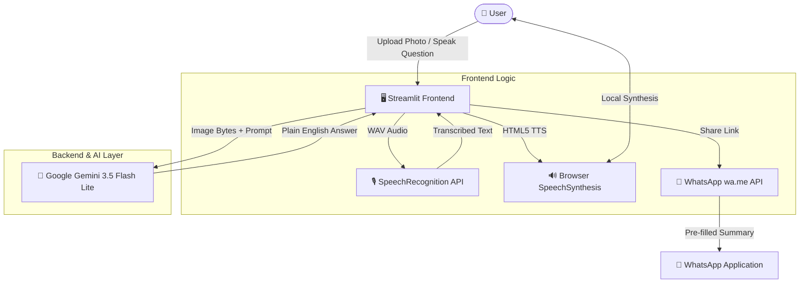

# 🩺 MediScan

> **Understand your medicine, not just its label.**

An AI-powered, vision-driven healthcare assistant designed to help patients, caregivers, and elderly users instantly understand prescription labels, packaging details, dosages, and safety precautions in clear, accessible English.

---

[](https://mediscan-care.streamlit.app/)
[](https://www.python.org/)
[](https://streamlit.io/)
[](https://deepmind.google/technologies/gemini/)

---

## 🚀 Live Demo

Experience **MediScan** live in your browser:
👉 **[https://mediscan-care.streamlit.app/](https://mediscan-care.streamlit.app/)**

---

## 📌 Overview

Understanding prescribed medication is critical for personal health, yet millions of people struggle daily with cryptic pharmaceutical labels, tiny typography, technical drug names, and confusing dosage schedules.

**MediScan** bridges this gap by acting as an intelligent visual reader and medical information assistant. Users simply capture or upload a photo of any medicine strip, bottle, or box. Utilizing multimodal AI, MediScan analyzes the image in seconds, extracts essential information—including active ingredients, general uses, printed dosage, and expiry status—and presents it in plain, human-friendly English.

Designed with accessibility and high contrast at its core, MediScan offers complete hands-free interaction through voice query recording, browser-native text-to-speech audio playback, quick-action clinical questions, and automated summary export via WhatsApp click-to-chat.

---

## 🚨 The Problem

* **Illegible & Dense Typography:** Expiry dates, drug concentrations, and manufacturer warnings are often printed in miniature text on reflective blister packs.
* **Complex Medical Jargon:** Active chemical names (e.g., *Paracetamol vs. Acetaminophen*, *Amoxicillin Trihydrate*) confuse non-expert patients.
* **Accidental Misuse & Expired Drugs:** Inability to locate or read manufacturing and expiry dates leads to accidental ingestion of degraded or expired drugs.
* **Low Vision & Elderly Barriers:** Seniors and visually impaired individuals often lack real-time assistance when taking daily medications.

---

## 💡 Our Solution

MediScan turns any smartphone camera into a clear, instant medication guide:

1. **Visual OCR & Image Recognition:** Direct vision processing of medicine labels without requiring manual text entry.
2. **Simplified Plain-English Explanations:** Complex pharmaceutical terms are translated into 5–8 clear, line-by-line bullet points.
3. **Safety-First Guardrails:** Strict AI directives ensure the system never invents missing information, never diagnoses conditions, and strictly prompts users to confirm unprinted dosages with a doctor.
4. **Multimodal Accessibility:** Voice input and instant speech synthesis ensure anyone can ask questions and listen to replies comfortably.

---

## ✨ Key Features

- **📷 Medicine Image Upload:** Seamless camera integration and image drag-and-drop support for medicine strips, boxes, and bottles.
- **🔎 AI-Powered Label Analysis:** Automatic identification of medicine names, active ingredients, strengths, and visible manufacturing/expiry dates.
- **📝 Plain-English Explanations:** High-contrast pharmacy-label UI formatting designed for low vision readability.
- **🎙️ English Voice Interaction:** Tap-to-record voice question input powered by native WAV audio recording and Google Web Speech recognition.
- **🔊 Text-to-Speech / Listen Functionality:** Instant, browser-native SpeechSynthesis audio playback with pause, resume, and stop controls (no external network latency).
- **👆 Quick Questions:** Pre-configured one-tap chips for common patient queries (*"What is this for?"*, *"How should I take it?"*, *"Is this expired?"*).
- **📤 WhatsApp Sharing:** One-click automated summary generation with direct `wa.me` click-to-chat pre-filled formatting.
- **🛡️ Safety-Focused Responses:** Enforced safeguards preventing diagnostic claims, treatment suggestions, or speculative dosing.
- **⚠️ Medical Disclaimer Notice:** Prominent medical disclaimers on every answer card emphasizing doctor or pharmacist confirmation.

---

## 🔄 How MediScan Works

```
┌─────────────────┐
│ Medicine Photo  │  Upload or capture medicine strip / packaging
└────────┬────────┘
         │
         ▼
┌─────────────────┐
│ Image Analysis  │  Gemini vision model extracts details & dates
└────────┬────────┘
         │
         ▼
┌─────────────────┐
│ Medicine Info   │  Formatted pharmacy card with plain-English breakdown
└────────┬────────┘
         │
         ▼
┌─────────────────┐
│ Ask a Question  │  Voice input, text chat, or quick chips
└────────┬────────┘
         │
         ▼
┌─────────────────┐
│   AI Response   │  Safety-checked contextual reply
└────────┬────────┘
         │
         ▼
┌─────────────────┐
│  Listen / Share │  Browser text-to-speech or WhatsApp export
└─────────────────┘
```

---

## 🎙️ Voice Interaction

MediScan provides complete audio accessibility designed for hands-free or low-vision usage:

* **Voice Input (Speech-to-Text):** Uses Streamlit's native audio recording widget to capture 16 kHz uncompressed WAV audio. The recording is transcribed via the lightweight Google Web Speech API endpoint (`SpeechRecognition`), keeping the vision model focused entirely on contextual reasoning.
* **Voice Playback (Text-to-Speech):** Utilizes browser-native `window.speechSynthesis` HTML5 APIs (`en-IN` voice target). Audio synthesis occurs locally on the client's device with **zero API costs**, **zero server delay**, and full playback controls (Play, Pause, Resume, Stop).

---

## 📱 WhatsApp Sharing

MediScan simplifies sharing medication summaries with family members, caregivers, or doctors:

1. Tap **"Send to WhatsApp"** after analyzing a medicine.
2. MediScan prompts Gemini to construct a concise, single-message plain-text summary of discussed medications, uses, precautions, and expiry statuses.
3. The system generates a formatted `https://wa.me/?text=...` link.
4. Tapping **"Open WhatsApp"** opens the user's native WhatsApp app with the message pre-filled and ready to send.

---

## 🛡️ Medical Safety

> **IMPORTANT:** MediScan is an educational assistant, **NOT** a doctor, pharmacist, or diagnostic platform.

* **No Diagnosis or Prescription:** MediScan will never diagnose symptoms, prescribe treatments, or suggest altered drug regimes.
* **Strict Dosage Rules:** MediScan *only* states dosage instructions if they are explicitly printed on the analyzed package label. If dosing is unprinted or ambiguous, MediScan explicitly directs the user to consult a healthcare professional.
* **Emergency Handling:** If a user mentions accidental overdose, severe allergic reactions, or pediatric/pregnancy risks, MediScan immediately advises contacting emergency medical services (e.g., 112 in India).

---

## 🧠 AI Architecture

MediScan leverages Google's **`gemini-3.5-flash-lite`** multimodal model via the official `google-genai` SDK:

```
                          ┌───────────────────────────┐
                          │   System Prompt Constraints│
                          │   - No guessing dosage     │
                          │   - Enforce plain English  │
                          │   - Today's date comparison│
                          └─────────────┬─────────────┘
                                        │
┌─────────────────────────┐             ▼             ┌─────────────────────────┐
│ User Input              ├──────────────────────────►│ Gemini Session Chat     │
│ - Medicine Photo        │                           │ - Temperature: 0.1      │
│ - Text / Voice Question │                           │ - Max Tokens: 700       │
└─────────────────────────┘                           └─────────────┬───────────┘
                                                                    │
                                                                    ▼
                                                      ┌─────────────────────────┐
                                                      │ Structured Response     │
                                                      │ - Name & Active Ingredients│
                                                      │ - Purpose & Precautions │
                                                      │ - Expiry Analysis       │
                                                      └─────────────────────────┘
```

* **System Prompt Guardrails:** Injected dynamically with the current date to enable precise expiry calculation (`"01 January 2025"` vs. printed expiry date).
* **Low-Temperature Inference (`0.1`):** Minimizes hallucinations and keeps clinical explanations consistent and factual.

---

## 🏗️ System Architecture



---

## 🛠️ Technology Stack

| Component | Technology | Purpose |
| :--- | :--- | :--- |
| **Language** | Python 3.10+ | Core application logic and API integrations |
| **Framework** | Streamlit (>=1.43) | Web interface, session state management, audio input |
| **AI / Multimodal** | Google Gemini (`google-genai`) | `gemini-3.5-flash-lite` image analysis and conversational QA |
| **Speech-to-Text** | PySpeechRecognition | Lightweight WAV speech transcription via Google Web Speech |
| **Text-to-Speech** | HTML5 / JavaScript Web Components | Browser-native `SpeechSynthesisUtterance` for local audio playback |
| **Styling** | HTML5 / CSS3 | High-contrast blister pack theme, typography, and card components |

---

## 📁 Project Structure

```
MediScan/
├── app.py                   # Main Streamlit execution flow, state, voice, & chat handlers
├── ui_parts.py              # Custom CSS styling, HTML components, pharmacy label layout
├── prompts.py               # AI system prompts, WhatsApp summary generator, safety guardrails
├── requirements.txt         # Core Python package dependencies
├── secrets.toml.example     # Template for configuring Gemini API key
└── README.md                # Project documentation
```

### Module Responsibilities
* **`app.py`**: Controls session state, onboarding flow, file upload validation, SpeechRecognition audio transcription, Gemini chat session dispatch, and WhatsApp share URL creation.
* **`ui_parts.py`**: Implements custom CSS styling ("blister pack" design system, responsive card components, accessible font stacks) and embeds the custom browser TTS JavaScript web component.
* **`prompts.py`**: Holds `SYSTEM_PROMPT` (safety rules, line formatting), `SUMMARY_REQUEST_PROMPT` (WhatsApp formatting), and default initial vision queries.

---

## 🚀 Run Locally

Follow these instructions to run MediScan on your local machine (Windows environment):

### Prerequisites
* Python 3.10 or higher installed
* A valid Google Gemini API Key from [Google AI Studio](https://aistudio.google.com/)

### Step-by-Step Setup

1. **Clone the Repository:**
   ```cmd
   git clone https://github.com/mpriyankainweb-bot/MediScan.git
   cd MediScan
   ```

2. **Create and Activate Virtual Environment:**
   ```cmd
   python -m venv venv
   venv\Scripts\activate
   ```

3. **Install Dependencies:**
   ```cmd
   pip install -r requirements.txt
   ```

4. **Configure Secrets:**
   Create a directory `.streamlit` and a file named `secrets.toml`:
   ```cmd
   mkdir .streamlit
   copy secrets.toml.example .streamlit\secrets.toml
   ```
   Open `.streamlit/secrets.toml` and add your API key:
   ```toml
   GEMINI_API_KEY = "YOUR_ACTUAL_GEMINI_API_KEY"
   ```

5. **Launch the Application:**
   ```cmd
   streamlit run app.py
   ```
   MediScan will open automatically in your default browser at `http://localhost:8501`.

---

## 🔐 Environment Variables / Secrets

MediScan relies on Streamlit's native secret management.

In local development, configure key storage in `.streamlit/secrets.toml`:
```toml
GEMINI_API_KEY = "AIzaSy..."
```

For production deployments (e.g., Streamlit Community Cloud), configure `GEMINI_API_KEY` under **App Settings > Secrets**.

> 🔒 **Security Notice:** Never commit `.streamlit/secrets.toml` or expose real API keys publicly in version control.

---

## 🌐 Deployment

MediScan is deployed on **Streamlit Community Cloud** with continuous deployment enabled directly from the `main` branch.

* **Live Application URL:** [https://mediscan-care.streamlit.app/](https://mediscan-care.streamlit.app/)
* **Hosting Platform:** Streamlit Community Cloud
* **API Secrets Management:** Embedded via Streamlit Cloud Secrets Manager

---

## 📸 Screenshots

| 📷 Step 1: Scan Medicine | 📝 Step 2: Clear Explanation |
| :---: | :---: |
|  |  |

| 🎙️ Step 3: Voice Interaction | 📤 Step 4: WhatsApp Export |
| :---: | :---: |
|  |  |

---

## 🔮 Future Scope

Ideas for future enhancements while keeping core simplicity intact:

* **🌐 Regional Language Support:** Optional multi-language synthesis (Hindi, Telugu, Tamil, Kannada, Marathi, Malayalam) for regional patients.
* **🔊 Advanced Speech Recognition:** Offline speech-to-text models (such as Whisper API integration) for noisy environments.
* **♿ Enhanced Vision Accessibility:** Screen-reader optimized layouts, voice command navigation, and auditory feedback signals.
* **📚 Verified Drug Database Verification:** Cross-referencing extracted active ingredients against standard pharmaceutical databases (e.g., FDA / CDSCO datasets).
* **🛡️ Interaction & Allergy Checks:** Optional user profile flags for known allergies or existing active drug interactions.

---

## ⚠️ Disclaimer

**MediScan is an informational and educational tool designed solely to assist users in reading public medicine packaging.**

MediScan is **NOT** a qualified doctor, pharmacist, or diagnostic medical device. Never disregard professional medical advice, delay seeking treatment, or alter prescribed medication doses based on information provided by this application. Always verify medication details and dosages directly with a certified medical professional or pharmacist.

---

## 👥 Credits / Project

Developed with a focus on human-centered AI, accessibility, and medical clarity.

* **Live App:** [https://mediscan-care.streamlit.app/](https://mediscan-care.streamlit.app/)
* **Repository:** [https://github.com/mpriyankainweb-bot/MediScan](https://github.com/mpriyankainweb-bot/MediScan)
